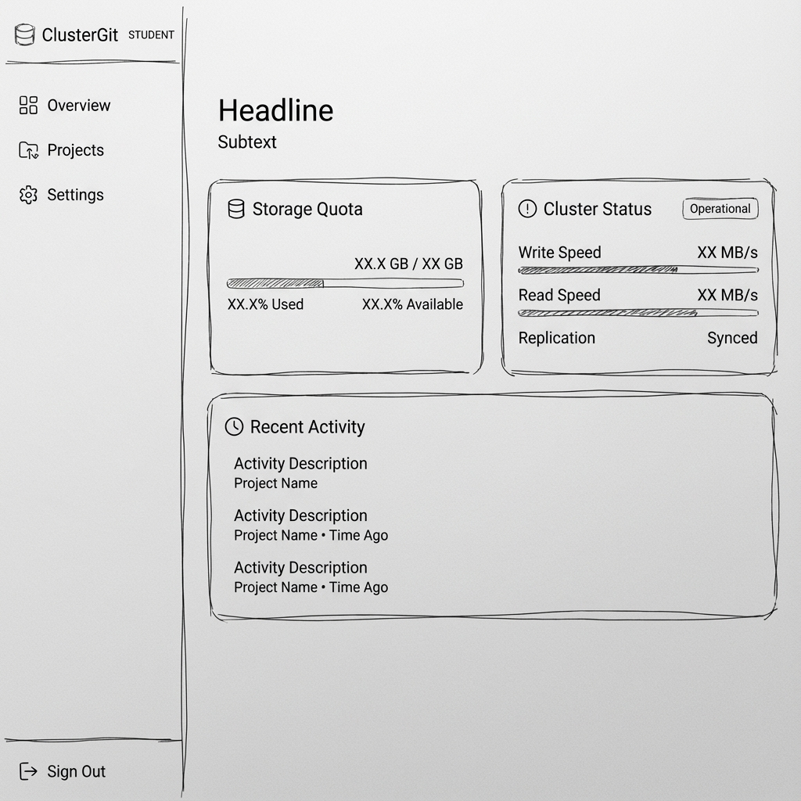
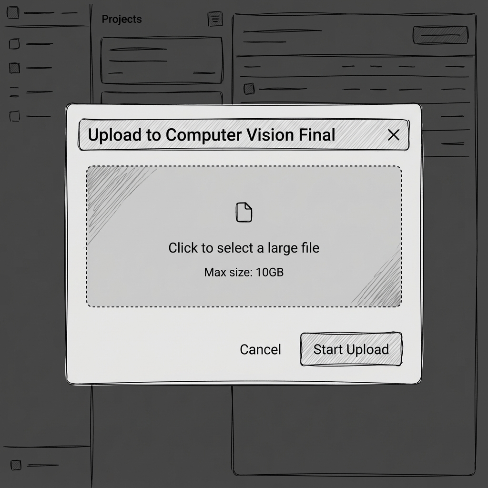
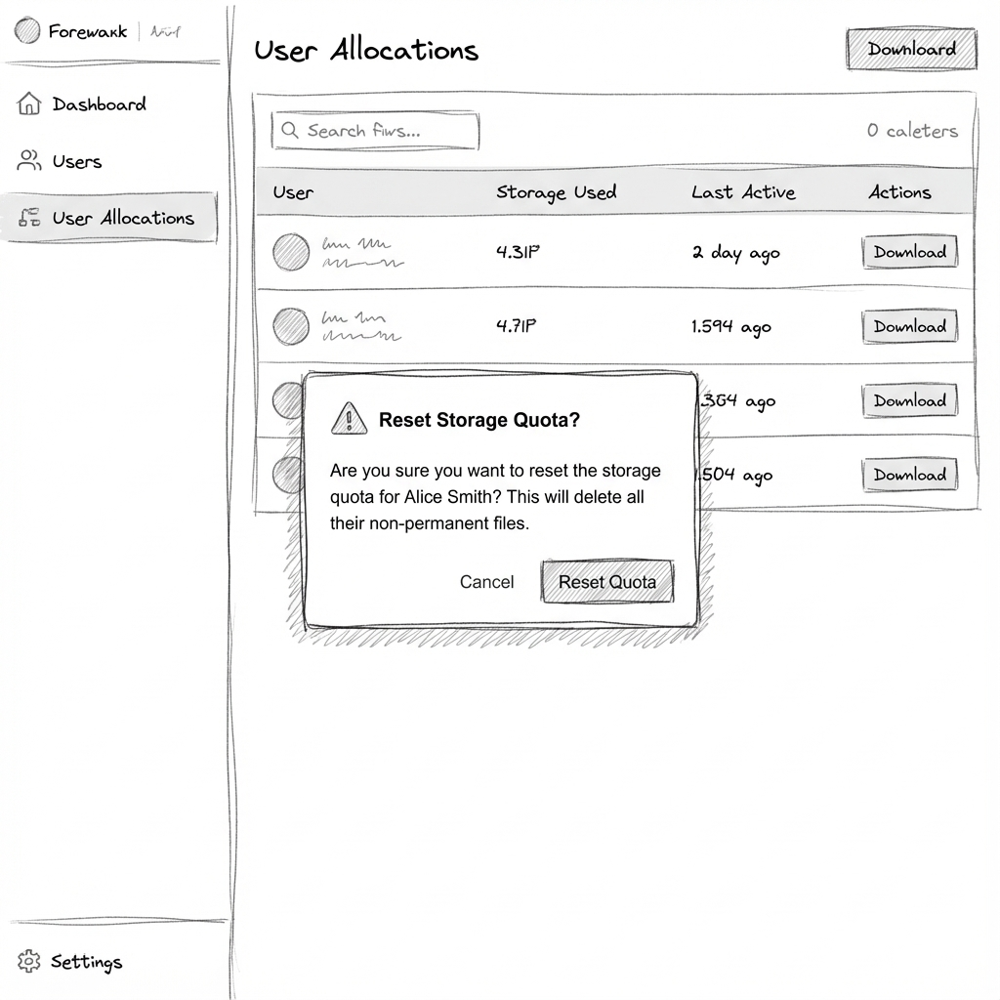

# Wireframes and UI Design Rationale

The visual design of ClusterGit evolved through structured phases that emphasized quota transparency, workflow clarity, and minimalism. The low-fidelity wireframes were created to experiment with layout, hierarchy, and interaction structure for both student and admin roles. These grayscale prototypes helped isolate the information architecture and test for usability without distractions from style or branding.

For the student interface, the initial wireframes centered on a project dashboard, upload modal, and file version history view. Design priorities included making quota usage visible at all times, reducing user uncertainty during uploads, and providing clear recovery paths for errors. Real-time feedback was placed near the action elements, such as embedding progress bars and system messages directly inside the upload window. File states such as pending, uploaded, or failed were given explicit icons from the beginning.

The admin interface was wireframed with an emphasis on scanning and control. Tables for quota management, node status, and reset actions were arranged with compact rows and tooltips. All destructive actions like quota resets were designed to be modal-gated with confirmation messages, helping prevent errors. The sidebar was retained across roles to preserve navigational consistency.

As the interface progressed into high-fidelity prototypes, we refined the component system and aligned it with a consistent design language. Primary buttons, toast messages, sidebar styles, and modal layouts were defined using a shared system to reinforce familiarity across screens. We retained grayscale accents and whitespace throughout the UI to avoid visual clutter and make usage metrics and warnings easier to detect. All typography followed a clear hierarchy, with font sizes and weights reinforcing page structure and visual grouping.

This progression from wireframes to finished mockups maintained the core HCI goals of visibility, feedback, and predictability. By validating interface structure early and then refining visual details later, the final product remained both clean and functional.

## Design Comparisons

### 1. Student Dashboard: Wireframe vs. High-Fidelity
| Low-Fidelity Wireframe | Final High-Fidelity Prototype |
|:---:|:---:|
|  |  |
| *Initial concept focusing on layout and storage summary.* | *Final design with polished typography, dark mode, and real-time status.* |

### 2. Upload Modal: Wireframe vs. High-Fidelity
| Low-Fidelity Wireframe | Final High-Fidelity Prototype |
|:---:|:---:|
|  |  |
| *Concept for modal interaction and drop zone.* | *Implemented modal with unified progress feedback and cancel actions.* |

### 3. Admin Quota Management: Wireframe vs. High-Fidelity
| Low-Fidelity Wireframe | Final High-Fidelity Prototype |
|:---:|:---:|
|  |  |
| *Sketching the reset flow and confirmation safety.* | *Final interface showing the "Error Prevention" modal in action.* |
