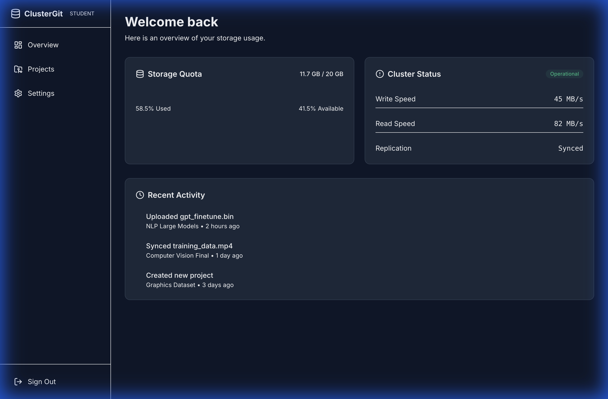
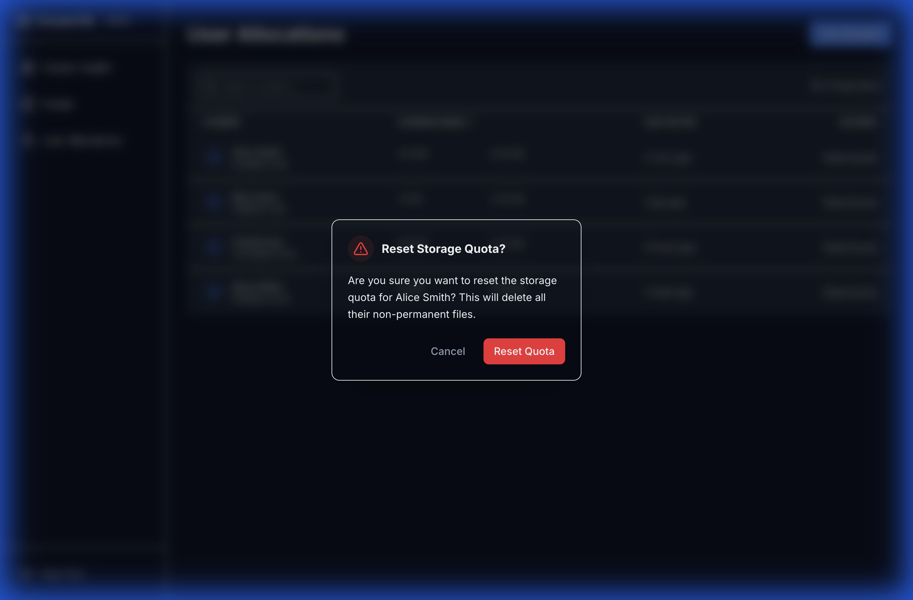
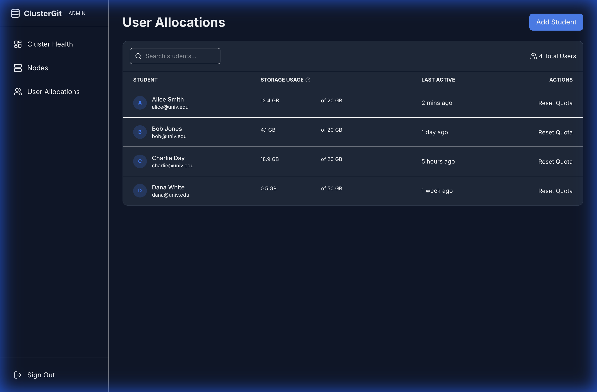
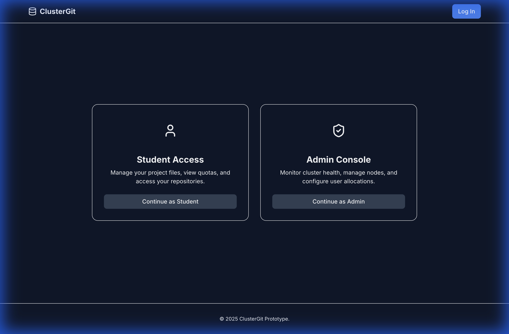
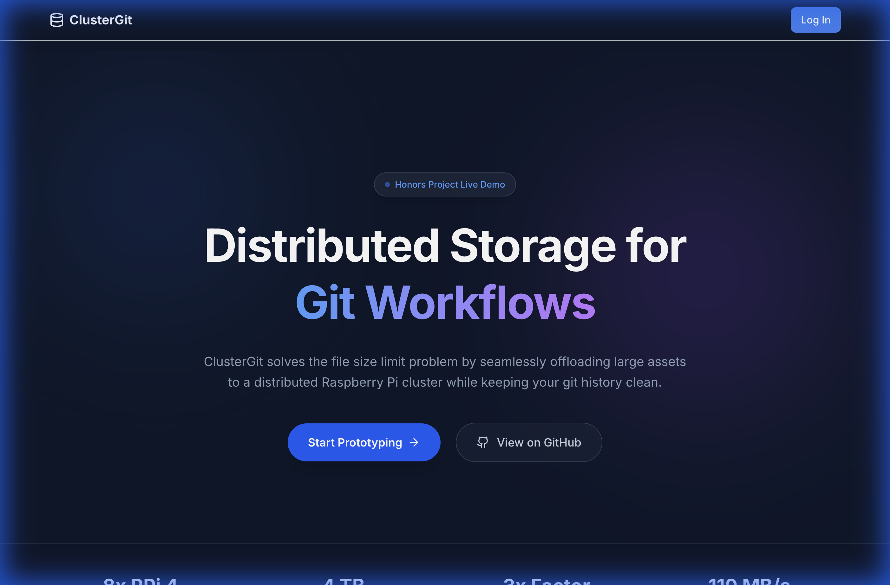
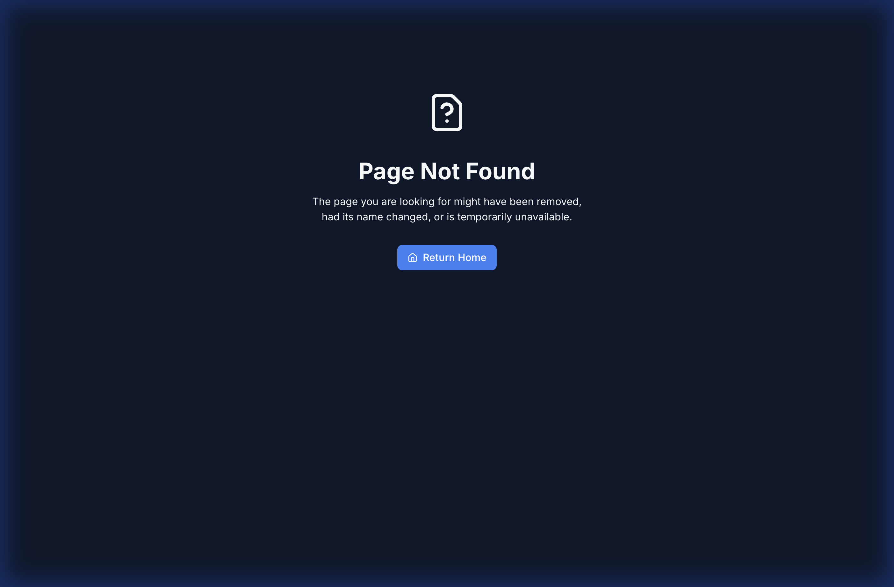

# Usability Heuristics Implementation Report

This document outlines how the **ClusterGit** prototype adheres to Nielsen's 10 Usability Heuristics.

## 1. Visibility of System Status
**Principle**: The design should always keep users informed about what is going on, through appropriate feedback within a reasonable amount of time.

**Implementation**:
- **Toast Notifications**: Every significant action (Login, Upload Start, Upload Complete, Errors) triggers a toast notification to give immediate feedback.
- **Progress Bars**: The file upload modal shows a real-time progress bar and status text ("Uploading", "Calculating", "Done").

## 2. Match Between System and the Real World
**Principle**: The system should speak the users' language, with words, phrases and concepts familiar to the user, rather than system-oriented terms.

**Implementation**:
- **Dashboard Terminology**: We use terms like "Projects", "Files", and "Quota" rather than technical node IDs or filesystem paths.
- **Visual Metaphors**: Folder and File icons are used in the project view to mimic a standard desktop file explorer.

## 3. User Control and Freedom
**Principle**: Users often perform actions by mistake. They need a clearly marked "emergency exit" to leave the unwanted state without having to go through an extended dialogue.

**Implementation**:
- **Cancel Button**: The Upload Modal includes a prominent "Cancel" button during the active upload process, allowing users to stop a large file transfer immediately.
- **Navigation**: Users can easily navigate back to the dashboard from any sub-page using the sidebar or breadcrumbs.

## 4. Consistency and Standards
**Principle**: Users should not have to wonder whether different words, situations, or actions mean the same thing. Follow platform and industry conventions.

**Implementation**:
- **Unified Design System**: All buttons (primary, ghost, danger) follow a strict color and spacing system defined in our global CSS.
- **Layout Consistency**: The "PublicLayout" (Login/Landing) and "DashboardLayout" (Student/Admin) share common header heights, font families, and container constraints (`max-w-7xl`).

## 5. Error Prevention
**Principle**: Good error messages are important, but the best designs carefully prevent problems from occurring in the first place.

**Implementation**:
- **Confirmation Modals**: Destructive actions, such as "Reset Quota" in the Admin panel, require an explicit confirmation step ("Are you sure? This cannot be undone.") to prevent accidental data loss.

## 6. Recognition Rather Than Recall
**Principle**: Minimize the user's memory load by making elements, actions, and options visible. The user should not have to remember information from one part of the interface to another.

**Implementation**:
- **Tooltips**: Complex admin metrics (like "Storage Usage") have tooltips explaining exactly what they mean, so admins don't have to recall the definition of specific calculations.
- **Visible Navigation**: The Sidebar always highlights the current active page.

## 7. Flexibility and Efficiency of Use
**Principle**: Shortcuts — hidden from novice users — may speed up the interaction for the expert user.

**Implementation**:
- **Role-Based Workflows**: The login screen splits immediately into "Student" and "Admin" paths, optimizing the experience for two very different user personas without cluttering one interface with the other's options.
- **Direct Actions**: Admin tables have direct action buttons ("Reset Quota") on rows rather than requiring navigation into a detail page first.

## 8. Aesthetic and Minimalist Design
**Principle**: Interfaces should not contain information which is irrelevant or rarely needed. Every extra unit of information competes with the relevant units of information.

**Implementation**:
- **Hero Section**: The landing page uses a clean, centered design with high-contrast typography and subtle background gradients, avoiding "wall of text" clutter.
- **Whitespace**: We purged dense tables in favor of spacious cards and rows with adequate padding (`p-4`, `p-6`) to reduce cognitive load.

## 9. Help Users Recognize, Diagnose, and Recover from Errors
**Principle**: Error messages should be expressed in plain language (no codes), precisely indicate the problem, and constructively suggest a solution.

**Implementation**:
- **404 Page**: If users navigate to a broken link, they are presented with a friendly 404 error page that explains the situation and provides a "Return Home" button to recover immediately.
- **Form Validation**: Input fields (like quota limits) prevent invalid entry and provide immediate visual cues (red borders) if inputs are malformed.

## 10. Help and Documentation
**Principle**: It’s best if the system doesn’t need any additional explanation. However, it may be necessary to provide documentation to help users understand how to complete their tasks.

**Implementation**:
- **Contextual Help**: We use "?" icons and tooltips in the Admin interface to provide inline documentation where it is most needed, rather than forcing users to read a separate manual.
- **Empty States**: If a student has no projects, the dashboard will display a helpful empty state guiding them to "Create your first project" (simulated).

