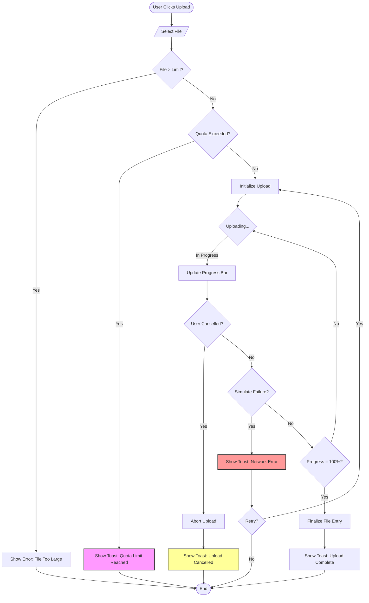
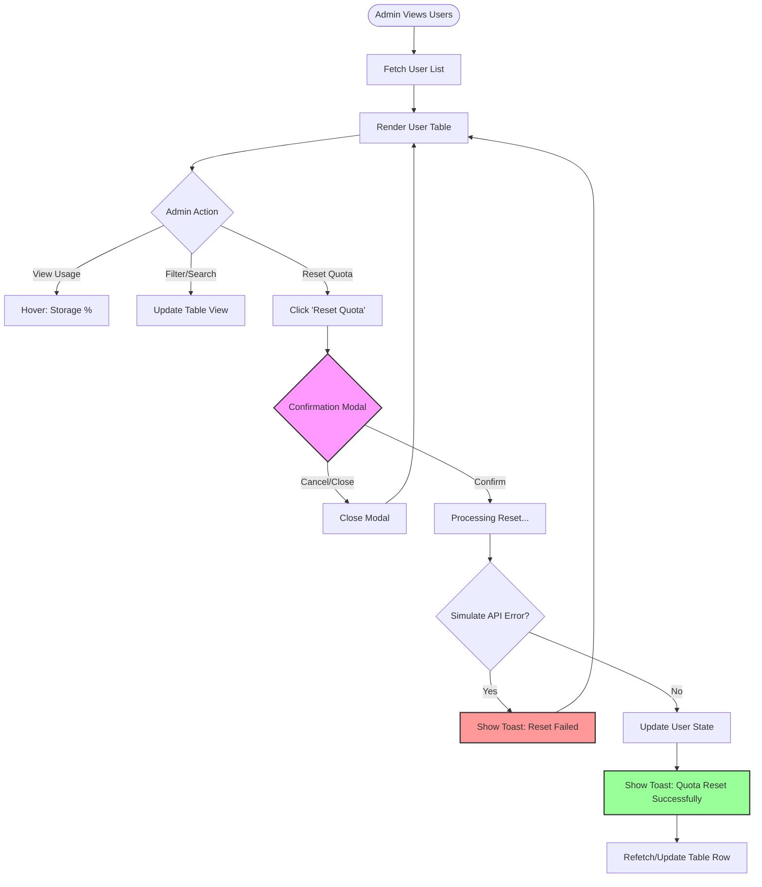
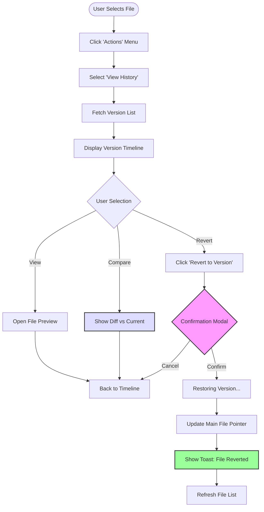

# System Workflow Diagrams

## 1. Student Upload Flow
This diagram illustrates the process of uploading a large file, including logic for quota enforcement, user cancellation, and error handling.

## 2. Admin Quota Management Flow
This diagram details the administrative workflow for monitoring user storage and resetting quotas, emphasizing the "Error Prevention" (H5) confirmation step.

## 3. Student File History & Version Control Flow
This diagram illustrates the user journey for managing file versions, covering the requirements for "User Control and Freedom" (H3) via the ability to revert changes.

